# 4 Gimp Lesson 4 ｜ Dodge & Burn and Smudge Tool

## Step 1: welcome to another gimp tutorial in this video
*starts 0:00, showcase 0:05, ends 0:12*

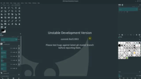

Instruction unavailable (Error code: 400 - {'tpe': 'fail.input.generic', 'errors': [{'description': 'Requested model is not supported', 'key': 'fail.input.generic', 'extras': None}], 'extras': None}).

## Step 2: these tools and we're going to be working with an
*starts 0:12, showcase 0:14, ends 0:51*

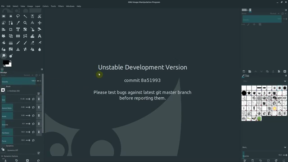

Instruction unavailable (Error code: 400 - {'tpe': 'fail.input.generic', 'errors': [{'description': 'Requested model is not supported', 'key': 'fail.input.generic', 'extras': None}], 'extras': None}).

## Step 3: don't worry about that for now it's just how gimp
*starts 0:51, showcase 0:53, ends 1:09*

Instruction unavailable (Error code: 400 - {'tpe': 'fail.input.generic', 'errors': [{'description': 'Requested model is not supported', 'key': 'fail.input.generic', 'extras': None}], 'extras': None}).

## Step 4: it's very very small right now so i may bring
*starts 1:09, showcase 1:10, ends 2:16*

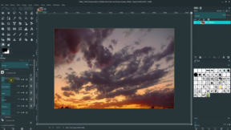

Instruction unavailable (Error code: 400 - {'tpe': 'fail.input.generic', 'errors': [{'description': 'Requested model is not supported', 'key': 'fail.input.generic', 'extras': None}], 'extras': None}).

## Step 5: can adjust the angle so now we have this an
*starts 2:16, showcase 2:18, ends 2:22*

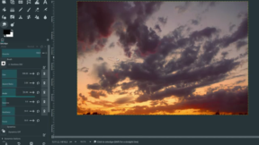

Instruction unavailable (Error code: 400 - {'tpe': 'fail.input.generic', 'errors': [{'description': 'Requested model is not supported', 'key': 'fail.input.generic', 'extras': None}], 'extras': None}).

## Step 6: so we can play with those and we've learned in
*starts 2:22, showcase 2:24, ends 2:31*

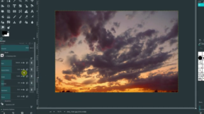

Instruction unavailable (Error code: 400 - {'tpe': 'fail.input.generic', 'errors': [{'description': 'Requested model is not supported', 'key': 'fail.input.generic', 'extras': None}], 'extras': None}).

## Step 7: to the brush itself and then but these are all
*starts 2:31, showcase 2:32, ends 3:22*

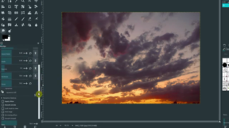

Instruction unavailable (Error code: 400 - {'tpe': 'fail.input.generic', 'errors': [{'description': 'Requested model is not supported', 'key': 'fail.input.generic', 'extras': None}], 'extras': None}).

## Step 8: it to to different things let's look at the dodge
*starts 3:22, showcase 3:24, ends 4:07*

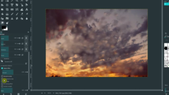

Instruction unavailable (Error code: 400 - {'tpe': 'fail.input.generic', 'errors': [{'description': 'Requested model is not supported', 'key': 'fail.input.generic', 'extras': None}], 'extras': None}).

## Step 9: of the image so right now we have it set
*starts 4:07, showcase 4:09, ends 4:29*

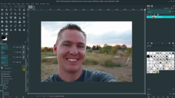

Instruction unavailable (Error code: 400 - {'tpe': 'fail.input.generic', 'errors': [{'description': 'Requested model is not supported', 'key': 'fail.input.generic', 'extras': None}], 'extras': None}).

## Step 10: burn is gonna be the opposite so if we select
*starts 4:29, showcase 4:32, ends 4:50*

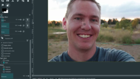

Instruction unavailable (Error code: 400 - {'tpe': 'fail.input.generic', 'errors': [{'description': 'Requested model is not supported', 'key': 'fail.input.generic', 'extras': None}], 'extras': None}).

## Step 11: so that's dodge and burn and there's different options right
*starts 4:50, showcase 4:52, ends 5:11*

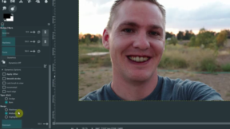

Instruction unavailable (Error code: 400 - {'tpe': 'fail.input.generic', 'errors': [{'description': 'Requested model is not supported', 'key': 'fail.input.generic', 'extras': None}], 'extras': None}).

## Step 12: some sort of oh and then i need to change
*starts 5:11, showcase 5:14, ends 5:43*

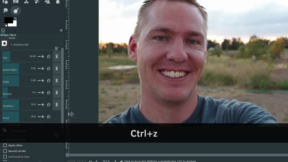

Instruction unavailable (Error code: 400 - {'tpe': 'fail.input.generic', 'errors': [{'description': 'Requested model is not supported', 'key': 'fail.input.generic', 'extras': None}], 'extras': None}).

## Step 13: and yeah that's really what we're gonna cover today so
*starts 5:43, showcase 5:45, ends 5:57*

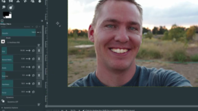

Instruction unavailable (Error code: 400 - {'tpe': 'fail.input.generic', 'errors': [{'description': 'Requested model is not supported', 'key': 'fail.input.generic', 'extras': None}], 'extras': None}).

## Step 14: all these brush settings and then down below it kind
*starts 5:57, showcase 5:59, ends 6:08*

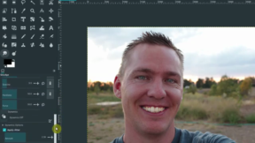

Instruction unavailable (Error code: 400 - {'tpe': 'fail.input.generic', 'errors': [{'description': 'Requested model is not supported', 'key': 'fail.input.generic', 'extras': None}], 'extras': None}).

## Step 15: play with those and the next video we'll look at
*starts 6:08, showcase 6:11, ends 6:20*

Instruction unavailable (Error code: 400 - {'tpe': 'fail.input.generic', 'errors': [{'description': 'Requested model is not supported', 'key': 'fail.input.generic', 'extras': None}], 'extras': None}).
